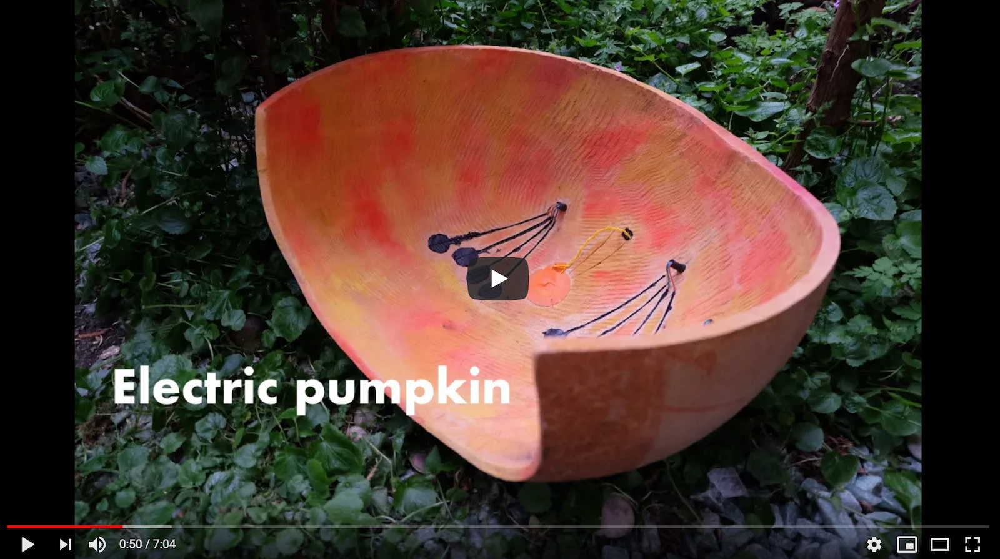
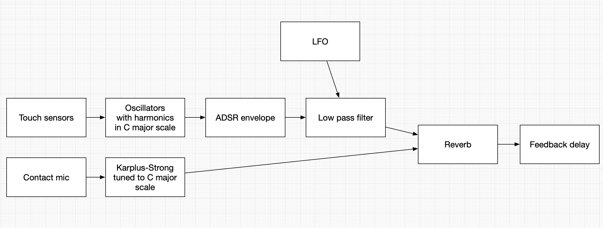

# Pumpkin

Electroacoustic musical instrument made out of pumpkin.

[](https://www.youtube.com/watch?v=SlfIT_5dkmY&)

## But why?

Some time ago I got an idea that I want to mae a musical instrument. However I am really not DAW user, do did not want to make a VST plugin. I really wanted something tangible. I also did not want to make a typical synth like interface with only knobs or buttons. I wanted something which can be played like an acoustic instrument but at the same time have digital audio capabilities.

I was looking for a suitable material and found that a lot of instruments can be made out of a pumpkin. It was cheap and simple enough to buy. I ordered one and was quite happy with how it looked and felt.

## Audio flow



Audio flow has 2 main sources of sound. First, We have 12 notes of C major scale which can be triggered by touching some conductive paint inside the pumpkin. Each of the notes is 2 saw waves going through a low pass filter. Low pass filter is modulated by an LFO. I also use a standard ADSR envelope to make the sound a bit more realistic. Then the other source is just drumming or scratching on the pumpkin which is picked up by a contact microphone. These drum sounds are used as an input for [Karplus-Strong](https://en.wikipedia.org/wiki/Karplus%E2%80%93Strong_string_synthesis).

Finally the sounds are mixed and go through a delay, or more correctly through a feedback comb filter. The decay coefficient is about 0.95, meaning that delay will be repeating for a very long time, almost like a looper. So any sound you make will be repeating and repeating and repeating. This allows for making quite complex ambient like.. hmm.. Soundscapes I guess.

## Software

The project is written in C++, this is mainly because I wanted to learn more of the language. It would probably be much faster to write the same functionality in PureData. Most of the DSP code is written from scratch, again for learning purposes. However, I did take some inspiration (and an occasional C++ class) from [The Synthesis Tool Kit](https://ccrma.stanford.edu/software/stk/) and [Ear level blog](https://www.earlevel.com/main/).

## Hardware & assembly

The code is running on a [Bela board](https://github.com/BelaPlatform/Bela), which has the audio and analog inputs/outputs required for the project. The only extra hardware is MPR121 capacitance sensor which in combination with conductive paint is used to touch events.

One of the more challenging parts was trying to fit the electronics in the pumpkin or in any way attach them to it. I wanted to keep hardware inside to the minimum, so decided to use an external box for the Bela and the knobs. The pumpkin itself just has:

- conductive paint with wires leading to the 3 wire sockets, each with 4 pins;
- contact microphone with wires leading to a 3.5 mm audio jack.

## Scripts

Set `$BELA_FOLDER` first, and then:

```console
"$BELA_FOLDER/scripts/build_project.sh" ./src -p pumpkin --force -m 'LDLIBS=-lstk CPPFLAGS=-std=c++11'

"$BELA_FOLDER/scripts/halt_board.sh"

"$BELA_FOLDER/scripts/set_startup.sh startup ./projects/pumpkin/"

"$BELA_FOLDER/scripts/set_startup.sh nostartup ./projects/pumpkin/"
```
